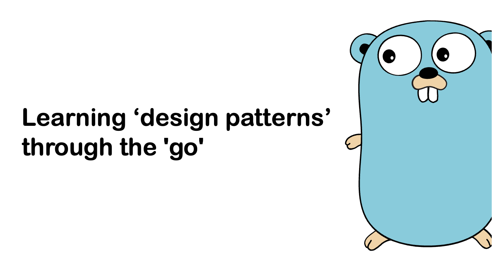

# GO 언어를 통해 디자인 패턴 구현하기

'Refactory Guru' [[링크]](https://refactoring.guru/ko/design-patterns/abstract-factory) 의 내용을 참조하여 go 언어로 디자인 패턴을 개발하는 방법에 대해 공부한 내용입니다

-----
* Factory Method [[링크]](./factory/readme.md)
* Abstract Factory [[링크]](./abstractFactory/readme.md)
* Builder [[링크]](./builder/README.md)
* Adaptor [[링크]](./adaptor/README.md)
* Command [[링크]](./command/README.md.md)