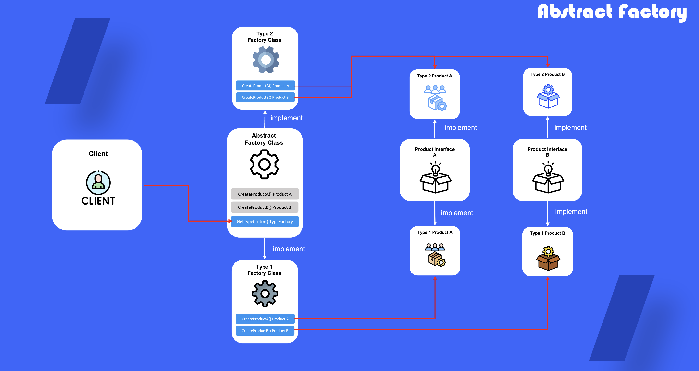

# Abstract Factory

## 1. 추상 팩토리란?

제품군에 대한 공통된 유형을 추상화하여 해당 유형 군에 대한 제품을 생성할 수 있도록 factory class를 만들어 제공하는 디자인 패턴

## 2. 추상팩토리를 사용하는 때

- 다양한 유형의 제품군이 형성 될 때 사용
- 구상 클래스에 대한 의존을 피하고 싶을 때 사용
- 팩토리 메서드들의 집합의 기본 책임이 뚜렷하지 않을때

## 3. 추상 팩토리 정의 방법

1) 제품군에 대한 인터페이스 정의

2) 인터페이스를 바탕으로 제품을 타입별로 구현 

3) 추상 팩토리 정의

4) 구현 제품의 타입별로 생성 팩토리 클래스 정의