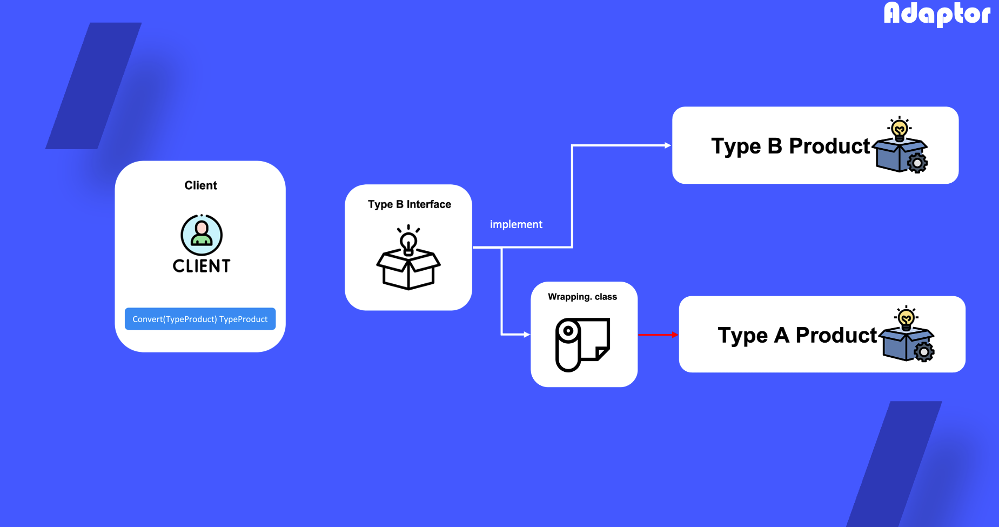

# Adaptor

## 1. 어댑터란?

특정 클래스를 다른 클래스의 형태로 변경하거나 해당 함수의 기능을 추상화하여 사용하고 싶을 때 사용하는 디자인 패턴

## 2. 어댑터를 사용하는 때?

- 기존 클래스를 사용하고 싶지만 인터페이스가 나머지 코드와 호환 되지 않을 때
- 부모 클래스에 추가할 수 없는 공통 기능들이 없는 자식 클래스들을 재사용하려고 할 때

## 3.  어댑터 정의 방법

1) 호환되지 않는 클래스 유무 파악

2) 클라이언트 인터페이스를 정의

3) 각 제품 군들이 클라이언트 인터페이스를 따르게 하도록 wrapping 클래스 개발