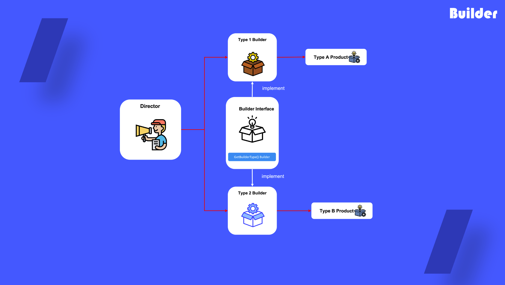

# Builder

## 1. 빌더 란?

복잡한 객체들을 단계별로 생성 할 수 있도록 하는 생성 디자인 패턴이며 같은 제작코드를 사용하여 객체의 다양한 유형들과 표현을 제작

## 2. 빌더를 사용하는 때?

- 점층적 생성자를 제거하기 위하여 빌더 패턴을 사용 - 객체 내의 매개변수가 많을 때
- 빌더 패턴은 당신의 코드가 일부 제품의 다른 표현을 생성하도록 하고싶을 때
- 빌더를 사용하여 복합체 트리를 생성하기 위해

## 3. 빌더를 정의하는 법

1) 빌더 인터페이스를 정의

2) 각 제품 생성을 위한 구상 빌더 클래스를 구현

3) 디렉터 클래스를 통해 빌더의 작업을 할당하기