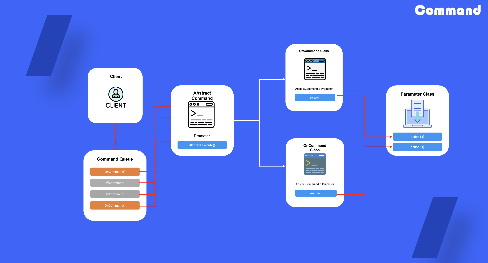

# Command

## 1. 커맨드 패턴이란?

요청을 요청에 대한 모든 정보가 포함된 독립 객체로 변환하는 행동을 하는 디자인 패턴

## 2. 커맨드를 사용하는 때

- 작업들로부터 객체를 매개 변수화 하려고 할 때
- 작업들의 실행을 예약하거나, 작업들을 대기열에 넣거나 작업들을 원격으로 실행하려는 경우에 사용
- 커맨드 패턴은 되돌릴 수 있는 작업을 구현하려고 할 때 사용

## 3. 커맨드 패턴 정의 방법

1) 하나의 실행 함수만 가지고 있는 command 추상 클래스 생성(추상 클래스 필드 내에 파라미터를 담을 수 있는 속성 정의)

2) command 인터페이스를 바탕으로 구상 command 클래스 생성

3) 추상 클래스 파라미터 필드에 담을 구상 파라미터 클래스 생성

4) 작업 queue를 통해 command 구상 객체를 생성해 할당하여 작업 진행