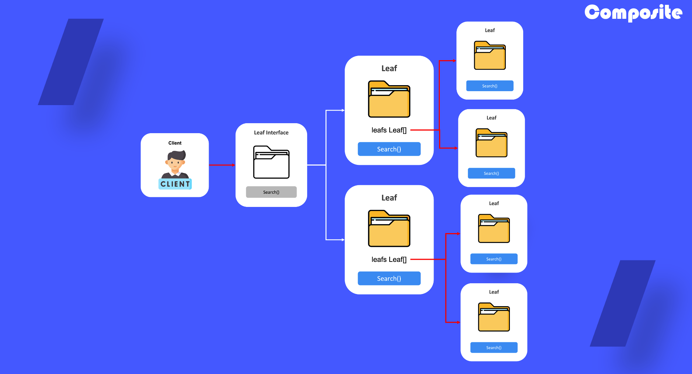

# Composite

## 1. 복합체 패턴이란?

객체들을 트리 구조들로 구성한 후, 이러한 구조들과 개별 객체들처럼 작업할 수 있도록 하는 구조 패턴입니다.

## 2. 복합체 패턴을 사용하는 때

- 나무와 잎과 같이 트리형태의 구조를 띄는 객체를 구현해야할 때 사용
- 단순요소와 복합요소를 균일하게 처리하고자 할때 사용

## 3. 복합체 패턴 정의 방법

1) 컴포넌트(leaf) 인터페이스를 정의

2) 인터페이스를 바탕으로 구상 객체 정의

3) 구상 객체에는 컴포넌트 객체가 담길 수 있는 속성 값정의