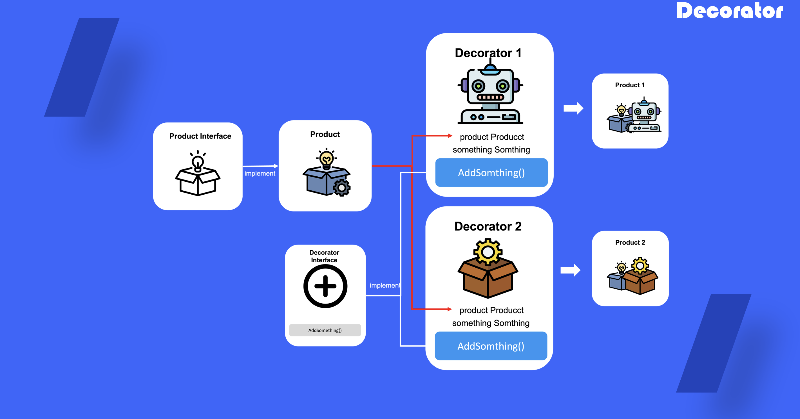

# Decorator

## 1. 데코레이터 패턴이란?

객체들을 특수한 행동을 추가한 새로운 래퍼 객체로 생성하여 사용하고자 할 때 사용하는 개발 패턴

## 2. 데코레이터 패턴을 사용하는 때

- 기존 객체를 유지하면서 런타임시 새로운 행동을 정의하고 싶을 때 사용
- 상속을 사용하여 객체를 구현하기 어렵거나 어색 할 때 사용

## 3. 데코레이터 패턴 정의 방법

1) 객체들 사이에 공통적인 메소드가 존재하는 지 확인 

2) 해당 함수들을 통해 추상화하여 인터페이스 정의

3) 구상 객체를 정의하기

4) 데코레이터 인터페이스 정의하기

5) 구상 데코레이터 객체를 정의하여 구상 객체를 포함하여 새로운 객체를 생성하도록 정의