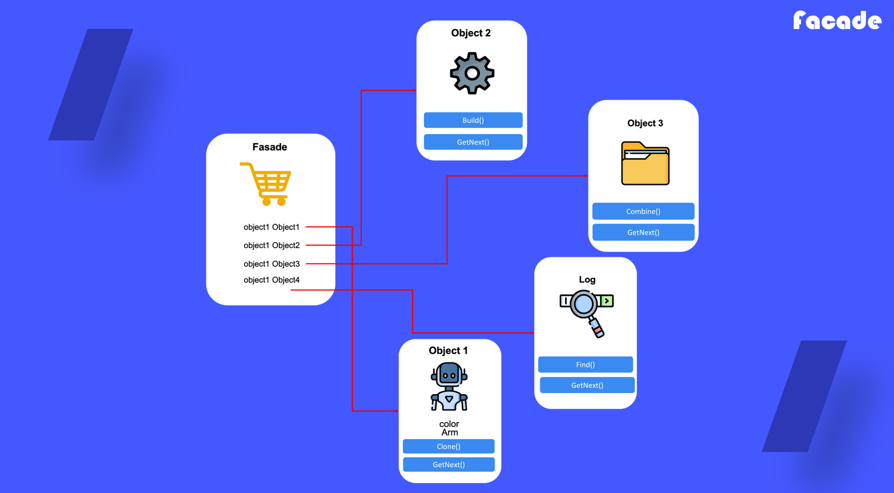

# Facade

## 1. 퍼사드 패턴이란

다른 패키지나 모듈에서 사용하는 복잡한 객체 형태 중 사용자가 사용하고자하는 일부분을 가져와 쓸 수 있도록 인터페이스로 제공하는 디자인 패턴

## 2. 퍼사드 패턴을 사용하는 때

- 복잡한 하위 시스템에 대해 제한적이지만 간단한 인터페이스가 필요로 할 때
- 하위 시스템을 계층적으로 관리하고자 할 때

## 3. 퍼사드 패턴 정의 방법

1) 복잡한 하위 시스템에서 사용하고자 하는 객체 선별

2) 선별된 객체들을 포함하는 클래스 정의

3) 퍼사드가 커질 경우 정제된 퍼사드로 다시 변경