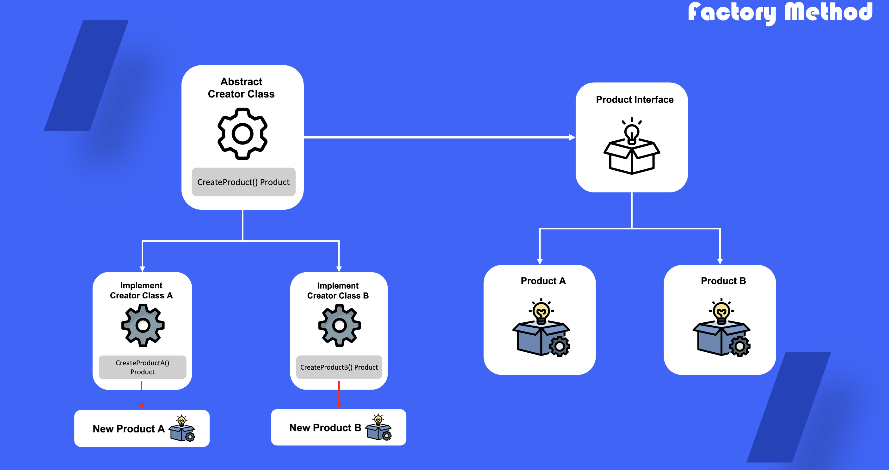

# Factory Method

## 1. 팩토리 메소드란?

부모 추상 클래스를 통해 인터페이스를 외부로 노출시키고 실제 객체 생성에 대한 로직은 자식 클래스에서 실행 하도록 개발하는 패턴

## 2. 팩토리 메소드를 사용해야하는 때

- 객체들의 의존관계와 정확한 유형들을 파악할 수 없을 때
- 내부 컴포넌트를 확장할 방법을 제시 하기위해
- 생성한 객체를 재사용 하기위해

## 3. 팩토리 메소드 정의 방법

1) 객체(product)에 대한 인터페이스 정의

2) (product)인터페이스에 맞게 객체 정의

3) 추상화 된 생성자 클래스 정의

4) 추상화 클래스를 바탕으로 실제 생성 클래스를 자식 클래스로 구현