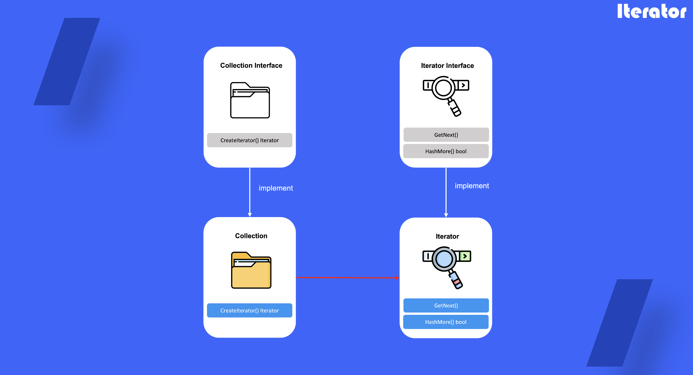

# Iterator

## 1. 반복자 패턴이란

컬렉션의 요소들의 기본 표현(리스트, 스택, 트리 등)을 노출하지 않고 그들을 하나씩 순회 할 수 있도록 하는 행동 디자인 패턴

## 2. 반복자를 사용하는 때

- 컬렉션이 내부에 복잡한 데이터 구조가 있지만 복잡성을 보안이나 편의상의 이유로 은닉화 하고 싶을 때 사용
- 앱 전체의 순회 코드의 중복을 줄이기 위해
- 데이터의 구조를 순회하기를 원하거나 이러한 구조들의 유형을 미리 알 수 없을 때 사용

## 3. 반복자 정의 방법

1) Interator interface 생성 다음 요소를 가져오는 메서드가 있어야하며 편의를 위한 추가 메서드를 정의할 수 있음

2) Collection interface를 생성하여 반복자를 생셩하는 메서드를 정의

3) Interator, Colllection interface를 기반하여 구생 클래스를 정의