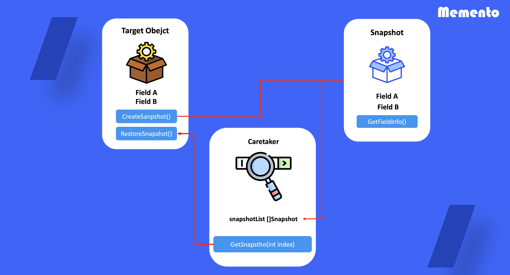

# Memento

## 1. 메멘토 패턴이란?

객체의 구현 상태를 공개하지 않으면서 객체의 이전상태를 저장하고 복구할 수 있도록하는 디자인 패턴

## 2. 메멘토 패턴을 사용하는 때

- 이전 상태를 스냅 샷 형태로 저장하여 복구하고 자 할 때 사용
- 객체들의 필드 값에 게터,세터를 통해 접근하는 것이 캡슐화를 위반할 때 사용

## 3. 메멘토 패턴 정의 방법

1) target object는 스냅샷을 만들 수 있는 함수를 정의

2) target object와 동일한 field 정보를 가지는 snapshot 객체를 정의

3) Caretaker 객체를 통해 스냅샷 버전 관리

4) target object의 Resotresnapshot 함수를 정의 함으로 특정 version의 스냅샷 복구