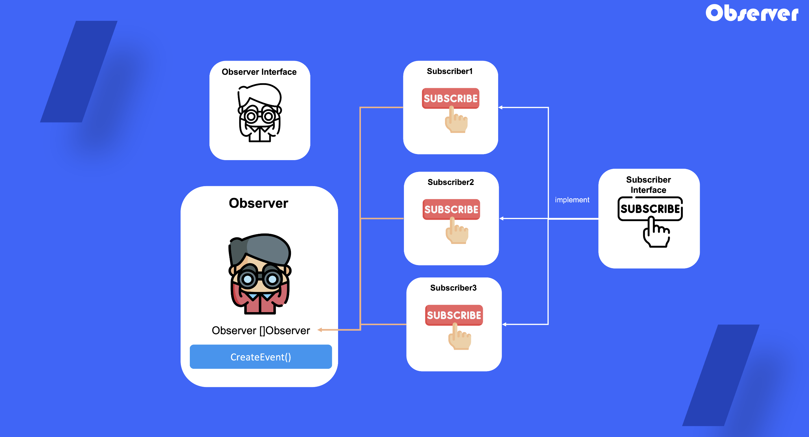

# Observer

## 1. 옵저버 패턴이란?

자신이 관찰 중인 객체에 발생하는 모든 이벤트에 대하여 알리는 구독 매커니즘 디자인 패턴

## 2. 옵저버 패턴을 사용하는 때

- 한 객체의 변경이 다른 객체의 변경의 필요성이 생겼을 때 사용

## 3. 옵저버 정의 방법

1) observer interface 정의 (subscriber에 대한 목록을 관리할 함수 추가[추가, 삭제])

2) 구상 observer 작성

3) subscriber interface 정의 (update를 통한 변경 반영 함수를 구현하도록 인터페이스 정의)

4) 구상 subscriber 작성