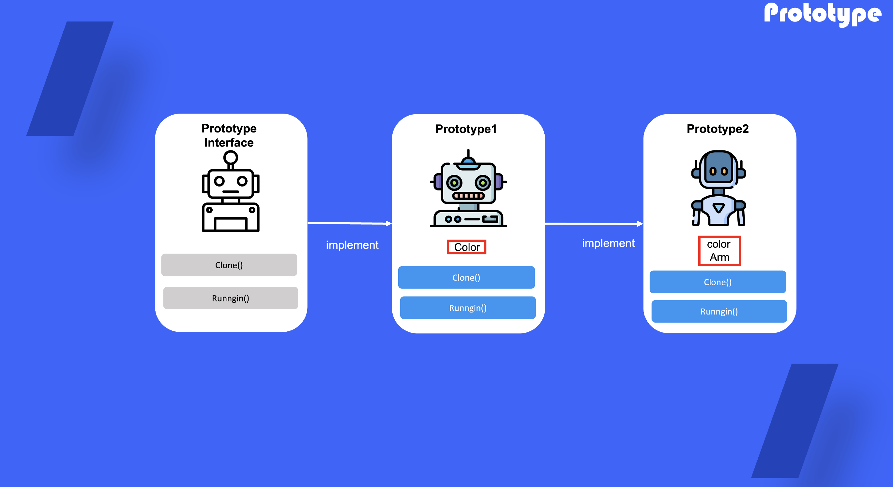

# Prototype

## 1. 프로토 타입 패턴이란?

코드들을 그들의 클래스에 의존시키지 않고 기존 객체들을 복사 할 수 있도록 하기위한 디자인 패턴

## 2. 프로토 타입을 사용하는 때

- 프로토타입 패턴은 복사해야 하는 객체들의 구상 클래스들에 코드가 의존하면 안 될 때 사용
- 프로토타입 패턴은 각자의 객체를 초기화하는 방식만 다른 자식 클래스들의 수를 줄이고 싶을 때 사용

## 3. 프로토타입 패턴 정의 방법

1) 프로토타입 인터페이스를 통해  추상화하기 → Clone 메소드를 통해 클래스를 복사하여 객체로서 사용할 수 있도록 추상화

2) 구현 클래스를 통해 객체 생성 → 해당 클래스는 클래스로 생성 된 객체를 인수로 받을 수 있는 대체 생성자를 clone에서 정읜