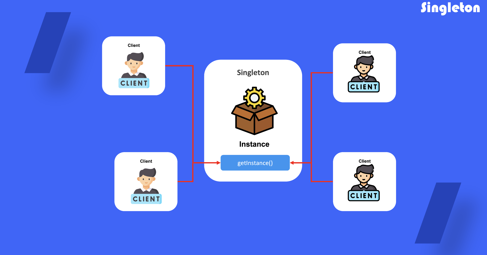

# Singleton

## 1. 싱글톤  패턴이란?

클래스에 인스턴스가 하나만 있도록 하면서 이 인스턴스에 대한 전역 접근(액세스) 지점을 제공하는 생성 디자인 패턴

**한 번에 두 가지의 문제를 동시에 해결함으로써 *단일 책임 원칙*을 위반**

- **클래스에 인스턴스가 하나만 있도록 합니다**
- **해당 인스턴스에 대한 전역 접근 지점을 제공합니다**

## 2. 싱글톤 패턴을 사용하는 때

- 전역 변수를 강하게 제어해야할 필요성이 있을 때
- 프로그램 내의 특정 클래스가 하나의 인스턴스만을 가지고 있어야할 때

## 3. 싱글톤 패턴 정의 방법

1) 인스턴스를 공유하기 위한 비공개 속성을 만들어 클래스내에 정의

2) 비공개 속성에 접근 하기위한 메소드를 정의

3) 클래스의 생성자는 비공개로 정의