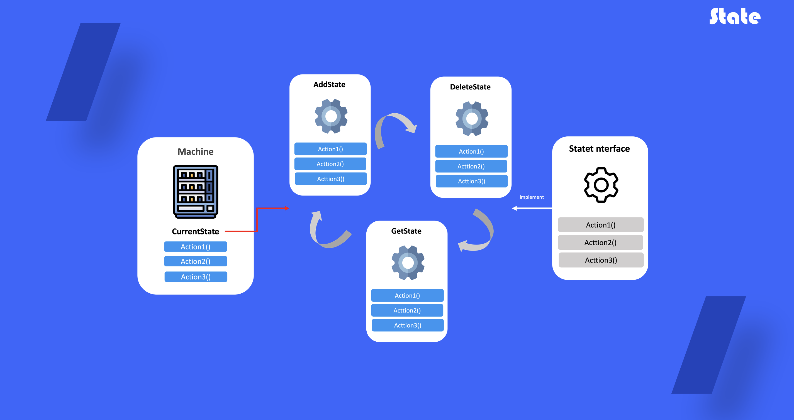

# State

## 1. 상태 패턴이란?

객체의 내부 상태가 변경될 때 해당 객체가 그의 행동을 변경할 수 있도록 하는 행동 디자인 패턴입니다. 객체가 행동을 변경할 때 객체가 클래스를 변경한 것처럼 보일 수 있습니다

## 2. 상태패턴을 사용하는 때

- 현재 상태에 따라 다르게 행동하는 객체가 있으며, 해당 객체가 많고, 상태별 코드가 자주변경 될 때 사용
- 거대한 조건문으로 인해 필드의 정보를 변경하여 사용할 때
- 상태들의 중복코드와 천이가 많을 때 사용

## 3. 상태 패턴 정의 방법

1) 콘텍스트로 지정될 클래스를 선정

2) 상태 인터페이스 정의

3) 각 구현 상태 클래스 정의 → 자신의 항목에 해당되는 함수가 실행 될 수 있도록 비즈니스 로직 구현