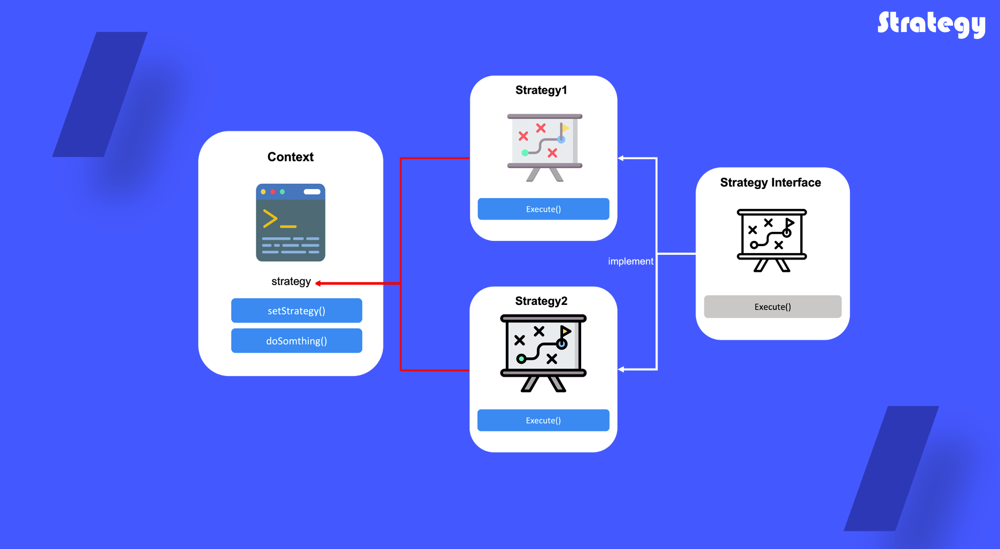

# Strategy

## 1. 전략 패턴이란?

알고리즘들의 패밀리를 정의하고 각 패밀리를 별도의 클래스에 넣은 후 그들의 객체들을 상호 교환 할 수 있도록 하는 행동 디자인 패턴

## 2. 전략 패턴을 사용하는 때

- 객체 내에서 한 알고리즘의 다양한 변형을 사용하고 싶을 때, 런타임 중에 다른 여러 알고리즘으로 전화하고 싶을 때
- 일부 행동을 실행하는 방식에서 차이가 있는 유사한 클래스가 많은 경우
- 알고리즘의 다른 변형들 사이를 전환하는 거대한 조건문이 당신의 클래스에 있는 경우

## 3. 전략 패턴 정의 방법

1) 콘텍스트 클래스에서 자주 변경되는 알고리즘 식별

2) 전략 인터페이스 선언

3) 전략 인터페이스를 통해 전략 클래스를 생성